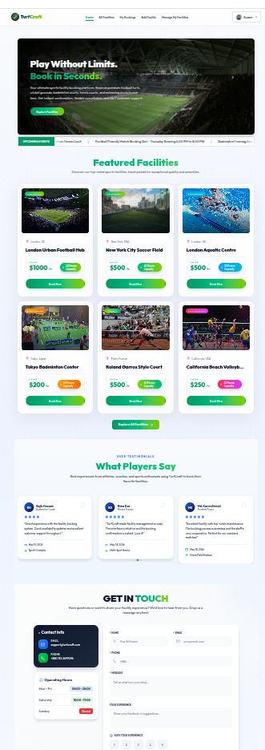
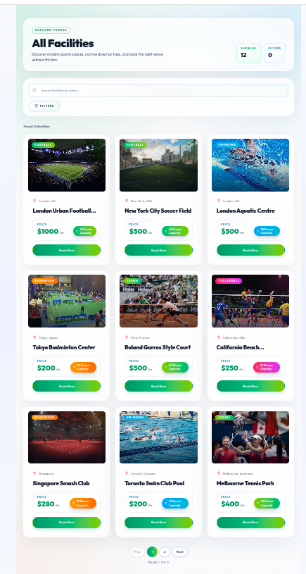
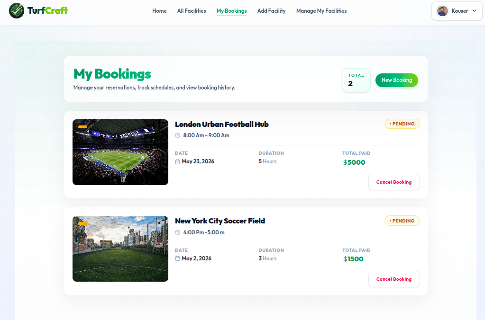
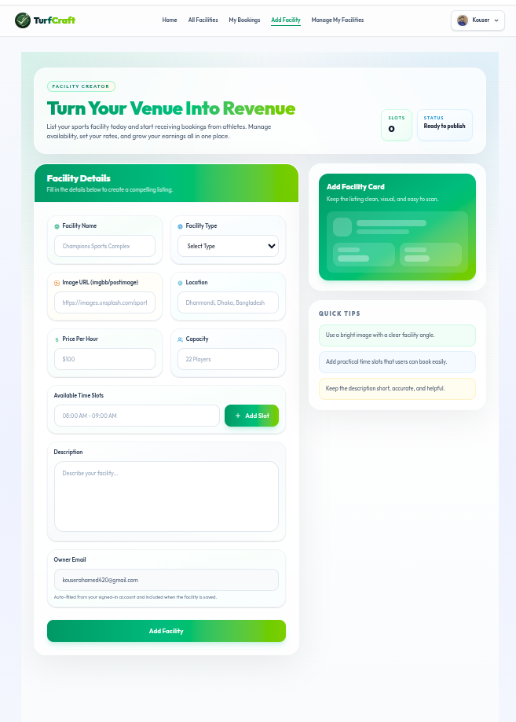
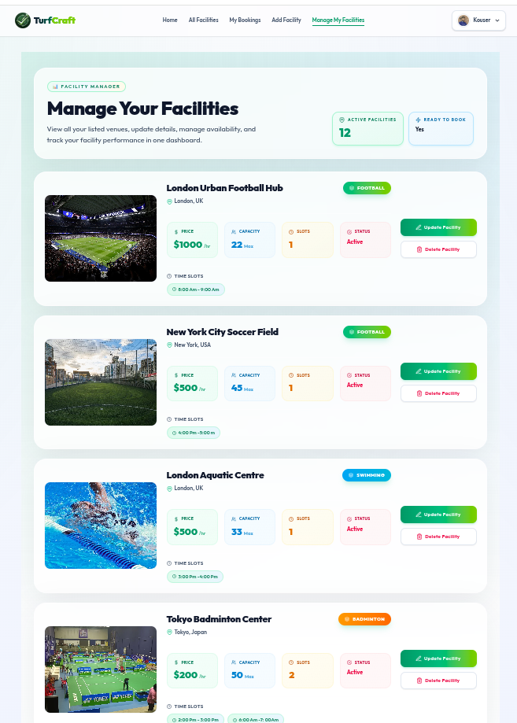
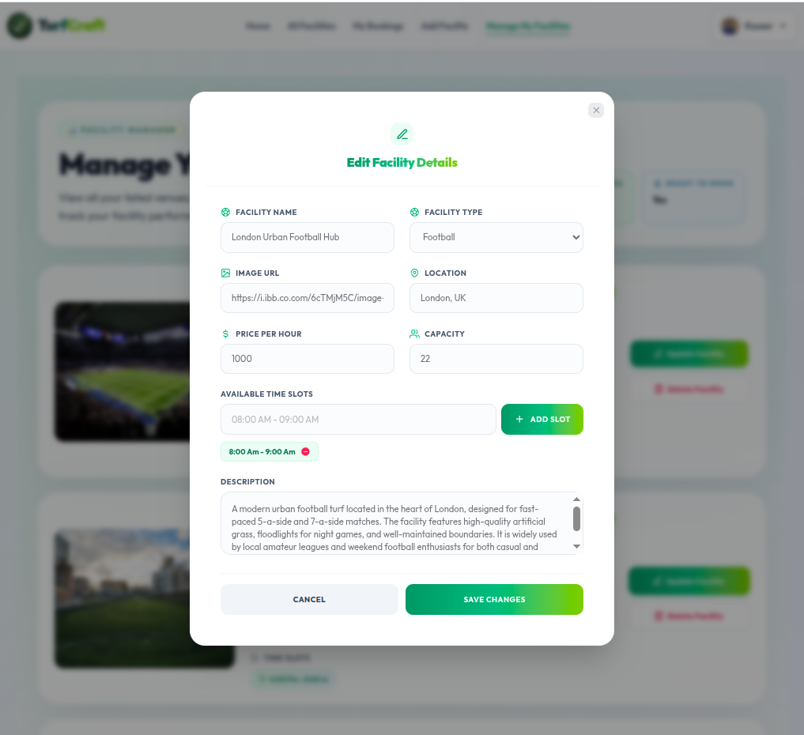
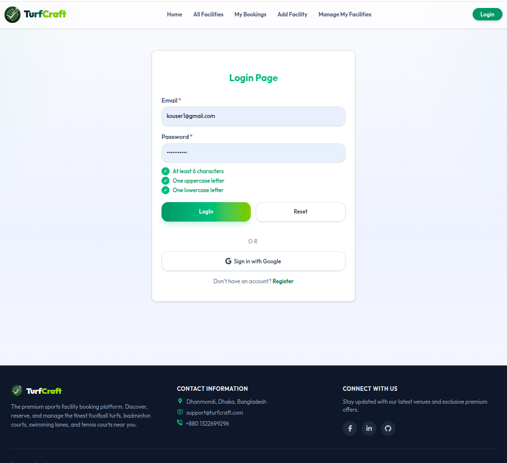
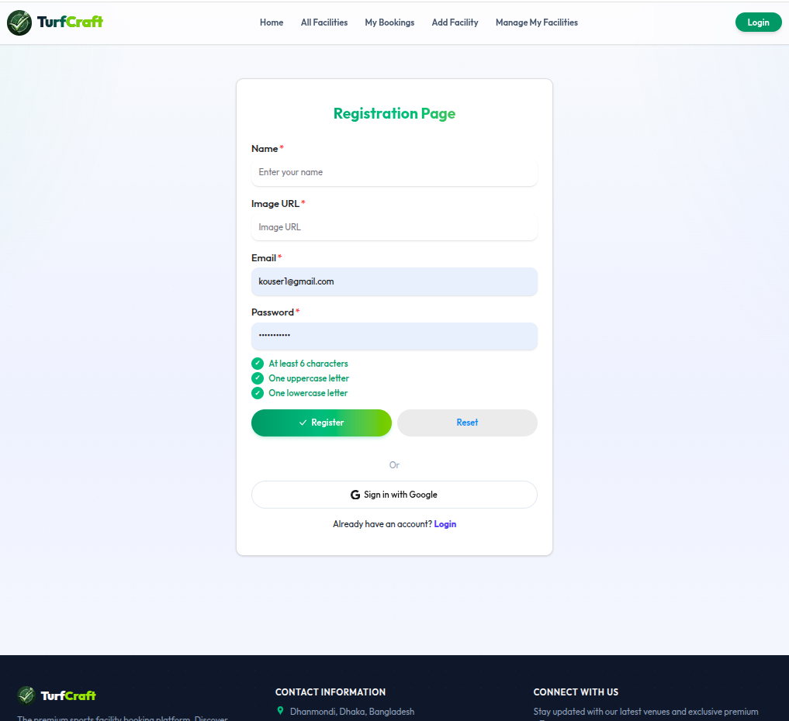

# ⚽ TurfCraft — Smart Sports Facility Booking Management Platform

## 📖 Introduction

In the modern digital era, convenience and accessibility have become essential parts of everyday life. From food delivery to online transportation systems, almost every service has evolved into a digital experience. However, sports facility booking systems in many regions still rely heavily on manual communication, phone calls, or physical scheduling processes, which often lead to confusion, double bookings, poor management, and inefficient user experiences.

To solve this real-world problem, **TurfCraft** was developed as a modern, scalable, and fully responsive sports facility booking management platform. The goal of this project is to provide a seamless digital ecosystem where users can effortlessly discover sports venues, schedule bookings, manage reservations, and interact with facility owners through a smooth and intuitive interface.

TurfCraft is designed not only as a booking website, but as a complete sports reservation management solution that combines modern frontend technologies, secure authentication systems, optimized database architecture, and responsive UI/UX principles into a professional full-stack application.

The platform allows users to explore different types of sports facilities including football turfs, badminton courts, swimming lanes, tennis courts, volleyball courts, basketball arenas, and more. Facility owners can also independently manage their venues, update schedules, modify pricing, and monitor bookings in real-time.

Built using the **MERN Stack** along with **Better Auth Authentication**, TurfCraft demonstrates real-world development practices, secure user management, responsive design systems, CRUD operations, protected routing, and scalable application architecture.

---

# 🌐 Live Website

🔗 https://turfcraft.vercel.app

---

# 💻 GitHub Repositories

## Client-Side Repository

🔗 https://github.com/kouser-ahamed/turfcraft

---

## Server-Side Repository

🔗 https://github.com/kouser-ahamed/turfcraft-server

---

# 🖼 User Interface Preview

















---

# 🎯 Project Vision

The primary vision of TurfCraft is to modernize the traditional sports facility reservation process by building a fast, secure, and user-friendly online platform where sports enthusiasts and facility owners can interact efficiently.

The project focuses on:

- Simplifying sports venue discovery
- Digitizing facility booking workflows
- Creating a responsive and accessible user experience
- Providing independent management systems for facility owners
- Building a scalable and production-ready full-stack application

TurfCraft aims to bridge the gap between sports communities and digital convenience by offering a streamlined booking experience that works smoothly across all devices.

---

# 🧠 Core Concept

TurfCraft is designed as a centralized sports reservation ecosystem where multiple users can browse, book, and manage facilities through a structured and secure system.

The application simulates real-world sports booking operations by integrating:

- Dynamic facility management
- Real-time booking workflows
- Secure authentication systems
- Protected dashboard operations
- Role-based functionality
- Responsive UI architecture
- Database-driven interactions

Unlike basic CRUD projects, TurfCraft focuses heavily on usability, performance optimization, professional UI consistency, and real-world application flow.

---

# ⚙️ Technology Stack

## 🖥 Frontend Technologies

### Next.js (App Router)

Next.js was used to create a modern frontend architecture with:
- Server-side rendering
- Dynamic routing
- Optimized performance
- Smooth navigation experience
- Improved SEO capabilities

---

### React.js

React powers the component-based structure of the application and provides:
- Reusable UI components
- Dynamic state management
- Interactive user interfaces
- Efficient rendering systems

---

### Tailwind CSS

Tailwind CSS was used for:
- Utility-first responsive styling
- Consistent spacing systems
- Clean visual hierarchy
- Mobile-first responsive layouts
- Professional UI implementation

---

### HeroUI

HeroUI enhances the application through:
- Beautiful dialogs and modals
- Modern UI components
- Interactive alerts
- Smooth user interaction systems

---

# 🔐 Backend & Authentication

## Better Auth Authentication

The authentication system provides:
- Secure user registration
- Login functionality
- Google authentication
- Session persistence
- Protected private routes
- Authentication-based redirection

The authentication workflow ensures users remain securely logged in even after page reloads.

---

## Node.js & Express.js

The backend server handles:
- API routing
- Booking operations
- Facility CRUD functionality
- Database communication
- Secure request handling

Express.js was used to create scalable RESTful APIs with clean route structures.

---

## MongoDB Database

MongoDB stores:
- Facility information
- User booking data
- Owner-related facility management data
- Dynamic scheduling information

The database structure was designed to support scalable and flexible application growth.

---

# ✨ Major Features & Functionalities

# 🏠 1. Modern Home Page Experience

The homepage is designed to immediately engage users through a clean and visually balanced layout.

### Home Page Includes:
- Professional hero banner section
- Clear call-to-action buttons
- Dynamic featured facilities section
- Additional custom-designed sections
- Responsive grid layouts
- Interactive hover animations

The design maintains consistent spacing, equal card sizing, and modern typography throughout the interface.

---

# ⚽ 2. Dynamic Sports Facility System

Users can explore a variety of sports venues dynamically fetched from MongoDB.

### Supported Facility Types:
- Football Turf
- Badminton Court
- Swimming Lane
- Tennis Court
- Volleyball Court
- Basketball Court

### Each Facility Includes:
- High-quality image preview
- Facility title
- Sports category
- Pricing details
- Location information
- Capacity details
- Available time slots
- Detailed descriptions

---

# 📅 3. Smart Booking Management System

The booking system was designed to simulate real-world reservation workflows.

### Booking Features:
- Date-based reservation system
- Time slot selection
- Duration selection
- Dynamic total price calculation
- Booking status management
- Pending approval system

### Booking Status Types:
- Pending
- Approved
- Confirmed
- Cancelled

The system ensures users can easily track and manage all reservations.

---

# 👤 4. My Bookings Dashboard

Authenticated users can manage all their booking activities from a dedicated dashboard.

### Dashboard Features:
- Booking history display
- Booking status visualization
- Reservation details
- Booking cancellation system
- Responsive booking cards
- Interactive user experience

---

# 🏟 5. Facility Owner Management System

Facility owners have complete control over their added venues.

### Owner Functionalities:
- Add new facilities
- Update facility information
- Delete facilities
- Manage schedules
- Edit pricing and capacity
- Maintain booking availability

This functionality creates a realistic multi-user management environment.

---

# 🔍 6. Search & Filter System

TurfCraft includes an intelligent search and filtering experience to improve usability.

### Features:
- Search by facility name
- Filter by sports category
- Real-time facility filtering
- MongoDB regex-based search queries
- Fast and responsive interactions

---

# 🔐 7. Protected Routing & Security

Security was a major priority during development.

### Security Features:
- Protected private routes
- Secure session handling
- Environment variable protection
- MongoDB credential security
- Authentication-based API protection
- HTTP-only cookie support

The application ensures secure user interactions throughout the system.

---

# 🧭 8. Responsive Navigation System

The navigation system dynamically changes based on authentication state.

### Navbar Includes:
- Logo & branding
- Conditional authentication UI
- Profile dropdown menu
- Private navigation links
- Mobile responsive navigation drawer

---

# 🦶 9. Professional Footer Section

The footer contains:
- Contact information
- Social media links
- Copyright section
- Clean responsive layout

The new modern X logo was used instead of the older Twitter branding to maintain updated design consistency.

---

# 📱 10. Fully Responsive Design

TurfCraft was designed with a mobile-first approach and optimized for:

- 📱 Mobile Devices
- 📲 Tablets
- 💻 Desktop Screens

Every section maintains:
- Consistent spacing
- Balanced typography
- Equal card dimensions
- Proper alignment
- Smooth responsiveness

---

# ⚡ Performance Optimization

Several optimization techniques were implemented to ensure smooth performance.

### Optimizations Include:
- Server-side rendering
- Optimized image handling
- Efficient component structure
- Dynamic route optimization
- Fast page transitions
- Reduced unnecessary re-renders

The platform delivers a fast and smooth user experience even during heavy interactions.

---

# 📦 NPM Packages Used

## Frontend Packages

- next
- react
- tailwindcss
- @heroui/react
- better-auth
- react-icons
- react-toastify
- swiper

---

## Backend Packages

- express
- mongodb
- cors
- dotenv

---

# 🚀 Local Development Setup

## 1️⃣ Clone Client Repository

```bash
git clone https://github.com/kouser-ahamed/turfcraft.git

# 🚀 Local Development Setup

## 1️⃣ Clone Client Repository

```bash
git clone https://github.com/kouser-ahamed/turfcraft.git
````

---

## 2️⃣ Clone Server Repository

```bash
git clone https://github.com/kouser-ahamed/turfcraft-server.git
```

---

## 3️⃣ Install Dependencies

### Client Side

```bash
npm install
```

### Server Side

```bash
npm install
```

---

## 4️⃣ Configure Environment Variables

### Client `.env.local`

```env
NEXT_PUBLIC_BASE_URL=http://localhost:3000
NEXT_PUBLIC_SERVER_URL=http://localhost:5000
BETTER_AUTH_SECRET=your_secret_key
```

---

### Server `.env`

```env
PORT=5000
MONGODB_URI=your_mongodb_connection_string
```

---

## 5️⃣ Run Development Servers

### Client Side

```bash
npm run dev
```

### Server Side

```bash
nodemon index.js
```

---

# 🚀 Deployment

The project was deployed using modern cloud hosting services:

### Frontend Hosting

* Vercel

### Backend Hosting

* Render / Node Hosting

### Database Hosting

* MongoDB Atlas

Deployment configuration ensures:

* Smooth route reloading
* No 404 issues on refresh
* No CORS problems
* Persistent authentication sessions
* Stable API communication

---

# ✅ Assignment Requirements Successfully Fulfilled

✔ Full-stack MERN application
✔ Better Auth authentication integration
✔ Protected private routes
✔ Dynamic facility management system
✔ Booking management workflow
✔ CRUD functionality
✔ Search & filtering system
✔ Responsive design for all devices
✔ Professional UI/UX implementation
✔ Secure environment variables
✔ Toast notification system
✔ Protected backend APIs
✔ Real-time database integration
✔ Meaningful GitHub commits
✔ Reload-safe routing system

---

# 🎓 Learning Outcomes & Development Experience

Developing TurfCraft provided valuable experience in:

* Building scalable MERN stack applications
* Managing secure authentication systems
* Creating production-style REST APIs
* Designing recruiter-friendly responsive UIs
* Implementing protected route architecture
* Handling dynamic MongoDB operations
* Structuring large-scale frontend applications
* Optimizing full-stack performance

This project significantly improved both frontend and backend development skills while reinforcing modern software engineering practices.

---

# 🧩 Conclusion

TurfCraft is a complete full-stack sports facility booking management system that combines modern design principles, secure authentication, scalable backend architecture, and responsive user experience into a polished production-style application.

The platform successfully demonstrates:

* Real-world problem solving
* Advanced full-stack development practices
* Secure authentication implementation
* Dynamic database-driven architecture
* Clean and maintainable code organization
* Professional UI/UX consistency
* Responsive and accessible web design

By integrating powerful frontend technologies with a structured backend system, TurfCraft delivers a seamless digital sports booking experience suitable for real-world usage.

The project reflects both technical capability and practical understanding of modern web application development while maintaining strong emphasis on usability, performance, and scalability.

```
```
